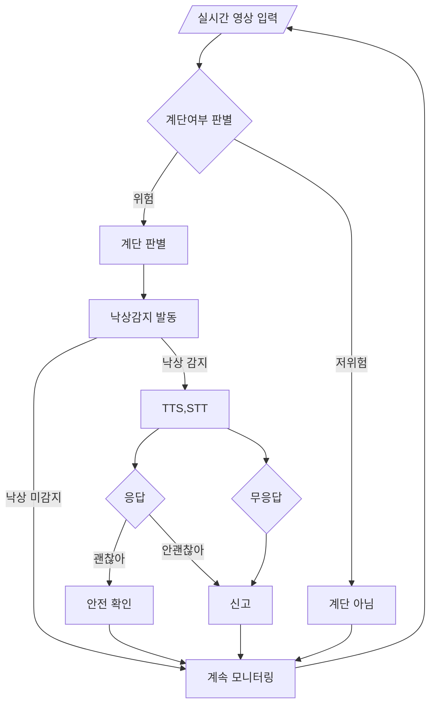

<div align="center">

# 🦺 SafeStep
### Intelligent Fall Detection & Location-Aware Emergency Response System

**MediaPipe · ResNet18 · TTS/STT · Real-time Vision**

<br>

[](https://www.python.org/)
[](https://pytorch.org/)
[](https://mediapipe.dev/)
[](https://opencv.org/)
[](LICENSE)

<br>

> 📌 **2026학년도 오픈소스프로그래밍 프로젝트** | 팀명: 오르락 내리락

</div>

---

## 📌 Table of Contents

- [Overview](#-overview)
- [Background & Motivation](#-background--motivation)
- [Key Features](#-key-features)
- [System Architecture](#-system-architecture)
- [Theoretical Background](#-theoretical-background)
- [System Flow](#-system-flow)
- [Dataset](#-dataset)
- [Requirements](#️-requirements)
- [Installation & Quick Start](#-installation--quick-start)
- [Results](#-results)
- [Limitations](#️-limitations)
- [Project Structure](#-project-structure)
- [Team](#-team)

---

## 📖 Overview

**SafeStep**은 고령자의 낙상 사고를 실시간으로 감지하고, 사고 발생 **장소(계단/평지)** 에 따라 차별화된 응급 대응을 자동으로 수행하는 지능형 시스템입니다.

기존 낙상 감지 기술의 한계:
- ❌ 단순히 '넘어짐' 자체만 판단 — 장소의 위험도를 고려하지 않음
- ❌ 계단 낙상(중증외상 위험)과 평지 낙상(경미한 경우)을 동일하게 처리
- ❌ 불필요한 행정력 낭비 및 정작 위험한 상황에서의 대응 지연

SafeStep의 해결책:
- ✅ **MediaPipe Pose** 기반 실시간 관절 추적으로 낙상 즉시 감지
- ✅ **ResNet18 CNN 전이 학습**으로 계단/평지 자동 분류
- ✅ 장소별 **차별화된 TTS/STT 응급 프로토콜** — 계단 낙상 시 즉시 119 신고

---

## 🔍 Background & Motivation

질병관리청 「제12차 국가 손상 종합 통계 2020」에 따르면, **60세 이상 입원 환자의 주요 손상기전은 추락·낙상(33.1%)** 으로 나타났습니다.

| 통계 | 수치 | 출처 |
|---|---|---|
| 65세 이상 고령자 안전사고 중 낙상 비율 | **47.4%** | 한국소비자원 CISS, 2017 |
| 65~84세 낙상 사망원인 중 계단 추락 비율 | **14.9%** | 통계청, 2024 |
| 고령자 안전사고 건수 (2016년) | **5,795건** | 한국소비자원 CISS, 2017 |

> 💡 **핵심 인사이트**: 평지 낙상은 경미한 경우가 많아 본인 확인 후 대응이 가능하지만,  
> **계단 낙상은 복합골절·뇌손상 등 중증외상으로 이어질 가능성이 높아 즉각적인 응급 대응이 필수**입니다.

---

## ✨ Key Features

| Feature | Description |
|---|---|
| 🦴 **실시간 낙상 감지** | MediaPipe Pose로 33개 관절 좌표를 실시간 추출하여 낙상 판별 |
| 🏗️ **장소 자동 분류** | ResNet18 CNN 전이 학습으로 계단(위험) / 평지(저위험) 분류 |
| 🔊 **양방향 음성 인터랙션** | Google TTS/STT로 낙상 후 사용자 상태 확인 및 자동 응답 |
| 🚨 **차별화된 응급 프로토콜** | 계단 낙상 시 즉시 119 및 보호자 긴급 알림 자동 전송 |
| 📊 **실시간 모니터링 대시보드** | 낙상 발생 시간, 장소, 대응 현황 실시간 표시 |

---

## 🏗 System Architecture

SafeStep은 **3개의 독립 모듈**이 유기적으로 연동되는 파이프라인 구조입니다.

```
[웹캠 실시간 영상 입력]
         │
         ▼
┌─────────────────────┐     ┌──────────────────────┐
│     Module 2        │────▶│      Module 1        │
│  장소 분류 (CNN)     │     │     낙상 감지         │
│  ResNet18           │     │  (MediaPipe Pose)    │
└─────────────────────┘     └──────────┬───────────┘
                                        │ 낙상 감지 시
                                        ▼
                             ┌──────────────────────┐
                             │      Module 3        │
                             │  TTS/STT 인터랙션    │
                             │  + 자동 신고          │
                             └──────────────────────┘
```

---

## 📚 Theoretical Background

### Module 1: Fall Detection — MediaPipe Pose

**MediaPipe Pose**는 Google이 개발한 실시간 인체 자세 추정 라이브러리로,  
단일 RGB 카메라 영상에서 **33개의 신체 랜드마크(관절 좌표)** 를 실시간으로 추출합니다.

<div align="center">
  
  <p><em>Figure 1. MediaPipe Pose — 33개 신체 랜드마크 (출처: Google MediaPipe)</em></p>
</div>

SafeStep은 아래 **3가지 조건을 동시에 만족**할 때 낙상으로 판정합니다.

#### ① 골반-무릎 Y좌표 역전 감지

정상 기립 상태에서는 골반(hip)의 Y좌표가 무릎(knee)보다 항상 위에 위치합니다.  
낙상 시 이 관계가 역전됩니다.

$$
\text{Fall Condition 1}: \quad Y_{hip} \geq Y_{knee}
$$

#### ② 신체 중심축 기울기 분석

어깨(shoulder)와 골반(hip)을 잇는 몸의 중심 라인이 지면과 이루는 각도를 계산합니다.  
낙상 시 이 각도가 급격히 감소합니다.

$$
\theta = \arctan\left(\frac{Y_{shoulder} - Y_{hip}}{X_{shoulder} - X_{hip}}\right) \times \frac{180}{\pi}
$$

$$
\text{Fall Condition 2}: \quad \theta \leq 50°
$$

#### ③ 바운딩 박스 종횡비 변화 감지

신체를 감싸는 가상의 바운딩 박스(Bounding Box)의 종횡비(Aspect Ratio)를 실시간으로 추적합니다.  
정상 상태(세로형)에서 낙상 상태(가로형)로 변할 때 비율이 감소합니다.

$$
\text{Aspect Ratio} = \frac{H_{bbox}}{W_{bbox}}
$$

$$
\text{Fall Condition 3}: \quad \text{Aspect Ratio} \leq 1.5
$$

> **최종 판별**: 위 3가지 조건이 **모두 동시에 만족**될 때 `Fallen State = True`로 판정합니다.

---

### Module 2: Location Classification — ResNet18 CNN

#### ResNet (Residual Network) 이란?

**ResNet**은 Microsoft Research가 2015년 발표한 딥러닝 모델로,  
**잔차 연결(Residual Connection, Skip Connection)** 을 도입하여  
매우 깊은 신경망에서도 기울기 소실(Vanishing Gradient) 문제를 해결한 혁신적인 CNN 구조입니다.

<div align="center">
  
  <p><em>Figure 2. ResNet Residual Block 구조 — Skip Connection이 핵심</em></p>
</div>

#### 잔차 블록 (Residual Block)

일반 CNN은 입력 $x$를 레이어에 통과시켜 $F(x)$를 학습합니다.  
ResNet은 여기에 원본 입력 $x$를 더하는 **Skip Connection**을 추가합니다:

$$
\text{Output} = F(x) + x
$$

$$
F(x) = W_2 \cdot \sigma(W_1 \cdot x + b_1) + b_2
$$

> 여기서 $\sigma$는 ReLU 활성화 함수, $W$는 가중치 행렬, $b$는 편향(bias)입니다.

#### 전이 학습 (Transfer Learning)

SafeStep은 **ImageNet으로 사전 학습된 ResNet18** 모델의 가중치를 가져와,  
마지막 Fully Connected Layer만 **계단/평지 2-class 분류**에 맞게 교체하여 학습합니다.

$$
\text{Output} = \text{Softmax}(W_{fc} \cdot \text{features} + b_{fc}), \quad \text{classes} = \{\text{stairs},\ \text{ground}\}
$$

이 방식은 적은 데이터셋(346장)으로도 높은 분류 정확도를 달성할 수 있게 합니다.

---

### Module 3: Voice Interaction — TTS / STT

#### STT (Speech-to-Text)

**Google Speech Recognition API**를 활용하여 마이크로 입력된 사용자의 음성을 텍스트로 변환합니다.  
`SpeechRecognition` 라이브러리의 **동적 주변 노이즈 조절(`adjust_for_ambient_noise`)** 을 적용하여  
소음 환경에서도 인식률을 향상시킵니다.

#### TTS (Text-to-Speech)

**Google TTS(gTTS)** 를 활용하여 상황에 맞는 안내 멘트를 자연스러운 한국어 음성으로 변환하고,  
`pygame`으로 재생합니다.

#### 응급 대응 프로토콜

- **평지(저위험)**: TTS로 상태 확인 → STT로 답변 인식 → 오보 필터링
- **계단(고위험)**: 즉시 119 및 보호자 긴급 알림 전송

---

## 🔄 System Flow



---

## 📂 Dataset

팀원 3인이 직접 촬영하여 구축한 **자체 데이터셋**을 사용합니다.

| 클래스 | 수량 | 특징 |
|---|---|---|
| 🪜 **계단 (stairs)** | 약 250장 | 나선형·돌계단 등 다양한 형태, 다양한 각도·밝기 |
| 🏞️ **평지 (ground)** | 약 96장 | 실내외 평지 환경 |
| **합계** | **346장** | 인당 약 100장 직접 촬영 |

**데이터 다양성 확보 전략:**
- 📐 다양한 **촬영 각도** (정면, 측면, 위에서 아래로 등)
- 💡 다양한 **조명 환경** (밝음, 어두움, 역광 등)
- 🏗️ 다양한 **계단 유형** (나선형, 돌계단, 실내계단, 야외계단 등)

---

## 🛠️ Requirements

```
Python >= 3.8
```

| 패키지 | 용도 |
|---|---|
| `opencv-python` | 웹캠 영상 입력 및 화면 렌더링 |
| `mediapipe` | 실시간 인체 관절 좌표 추출 (Module 1) |
| `numpy` | 관절 좌표 수치 계산 |
| `torch` | PyTorch 딥러닝 프레임워크 (Module 2) |
| `torchvision` | ResNet18 사전학습 모델 로드 |
| `Pillow` | 이미지 전처리 |
| `pillow-heif` | HEIF/HEIC 확장자 이미지 호환 |
| `SpeechRecognition` | STT — 음성을 텍스트로 변환 (Module 3) |
| `gTTS` | TTS — 텍스트를 음성으로 변환 |
| `pygame` | TTS 음성 파일 재생 |
| `PyAudio` | 마이크 하드웨어 접근 |

---

## 🚀 Installation & Quick Start

### 1️⃣ Git 설치 확인

터미널(명령 프롬프트)을 열고 아래 명령어로 Git이 설치되어 있는지 확인하세요:

```bash
git --version
```

> Git이 없다면 👉 [https://git-scm.com/downloads](https://git-scm.com/downloads) 에서 먼저 설치하세요.

---

### 2️⃣ 저장소 클론 (Git Clone)

> **Git Clone이란?**  
> 원격 GitHub 저장소의 모든 파일과 코드를 내 컴퓨터로 복사해오는 명령어입니다.  
> 아래 명령어 한 줄로 프로젝트 전체를 내려받을 수 있습니다.

```bash
# 원하는 폴더로 이동 후 아래 명령어 입력
git clone https://github.com/lce2005/SafeStep.git

# 클론된 폴더로 이동
cd SafeStep
```

---

### 3️⃣ 가상환경 생성 (권장)

다른 프로젝트와 패키지 충돌을 방지하기 위해 가상환경 사용을 강력히 권장합니다.

**Anaconda 사용 시 (권장):**
```bash
conda create -n safestep python=3.8 -y
conda activate safestep
```

**venv 사용 시:**
```bash
# 가상환경 생성
python -m venv venv

# 가상환경 활성화
source venv/bin/activate        # macOS / Linux
venv\Scripts\activate           # Windows
```

---

### 4️⃣ 의존성 패키지 설치

```bash
pip install -r requirements.txt
```

> ⚠️ **PyAudio 설치 오류 시 (Windows)**:
> ```bash
> pip install pipwin
> pipwin install pyaudio
> ```
>
> ⚠️ **PyAudio 설치 오류 시 (macOS)**:
> ```bash
> brew install portaudio
> pip install pyaudio
> ```

---

### 5️⃣ 학습된 모델 가중치 배치

`stair_classifier.pth` 파일을 프로젝트 루트 디렉토리에 위치시킵니다:

```
SafeStep/
├── stair_classifier.pth   ← 여기에 배치
├── test.py
└── ...
```

---

### 6️⃣ 실행

```bash
python test.py
```

웹캠이 자동으로 켜지며 실시간 낙상 감지 및 장소 분류가 시작됩니다.

> 💡 **종료**: 실행 중 `q` 키를 누르면 종료됩니다.

---

## 📈 Results

### ✅ 성공 사례

계단이 아닐 때 / 계단일 때를 나누어 낙상 감지 로직을 실행하고,  
낙상 감지 로직에 따라 `Fallen State`를 정확히 전환합니다.  
계단을 바라보는 카메라의 각도가 바뀌어도 안정적으로 실행에 성공했습니다.

<div align="center">
  
  <p><em>Figure 3. 계단 환경에서 낙상 감지 성공 — Fallen State: True, STAIR (SCANNING) 표시</em></p>
</div>

<div align="center">
  
  <p><em>Figure 4. 다양한 각도에서도 계단 인식 및 낙상 감지 성공</em></p>
</div>

### ❌ 한계 사례

| 문제 상황 | 원인 |
|---|---|
| 낙상 상태인데 `Fallen State = False` | 특정 자세에서 관절 좌표 3가지 조건 미충족 |
| 응급 상황을 정상으로 잘못 분류 | STT 인식 오류 (소음, 발음 불명확) |

---

## ⚠️ Limitations

| 한계점 | 상세 내용 |
|---|---|
| 🌙 **야간 환경** | MediaPipe는 RGB 카메라(빛)에 의존 — 불이 꺼진 야간 계단이나 어두운 방에서 관절 추출 불가 |
| 🌐 **인터넷 의존성** | Google STT/TTS는 클라우드 기반 — 오프라인 환경에서 작동 불가 |
| 🔊 **소음 환경** | TV 소리, 계단식 아파트 울림 소음 등이 섞이면 STT 인식률 급격히 저하 |
| ⏱️ **응답 지연** | TTS/STT 처리 시간으로 인해 실제 대화보다 응답 간 지연 발생 |
| 💻 **연산 부하** | MediaPipe + ResNet18 동시 실행 시 고성능 GPU 없는 환경에서 30FPS 처리 어려움 |

---

## 📁 Project Structure

```
SafeStep/
├── assets/                      # README용 이미지 파일
│   ├── result_success_1.png
│   └── result_success_2.png
│
├── data/                        # 학습 데이터셋
│   ├── stair/                   # 계단 이미지 (~250장)
│   └── ground/                  # 평지 이미지 (~96장)
│
├── stair_classifier.pth         # 학습된 ResNet18 모델 가중치
├── convert.py                   # 데이터 전처리 스크립트
├── test.py                      # 메인 실행 파일 (통합 모듈)
├── requirements.txt             # 의존성 패키지 목록
├── LICENSE
└── README.md
```

---

## 👥 Team

**팀명: 오르락 내리락** | 2026학년도 오픈소스프로그래밍

| 역할 | 이름 | 학번 | 담당 모듈 |
|---|---|---|---|
| 팀장 | 이채은 | 2513887 | Module 1 — MediaPipe 낙상 감지 알고리즘, 메인 함수 통합 |
| 팀원 | 김선형 | 2414822 | Module 2 — CNN 장소 분류 (ResNet18 전이 학습) |
| 팀원 | 김영서 | 2512440 | Module 3 — STT/TTS 인터랙션, 긴급 알림, 대시보드 |

**공통 작업:** 계단·평지·낙상 데이터셋 직접 촬영 (3인 공동)

---

## 📄 License

This project is licensed under the **MIT License** — see the [LICENSE](LICENSE) file for details.

---

<div align="center">

**⭐ 이 프로젝트가 도움이 되었다면 Star를 눌러주세요! ⭐**

Made with ❤️ by Team 오르락 내리락

[🔝 Back to Top](#-safestep)

</div>
